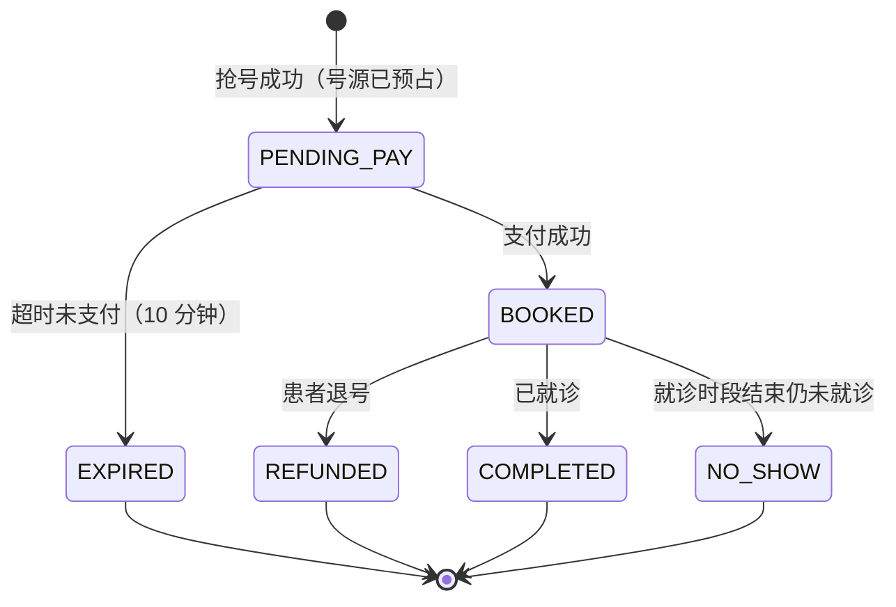

# 领域设计：医院预约挂号

> 这份文档定义业务域，以及它如何映射到已经验证过的库存引擎上。
> 引擎侧的实验数据与缺陷记录见 `docs/EXPERIMENTS.md`（六个压力画像、23 个已修复缺陷）。

---

## 1. 为什么选挂号，以及它为什么天然需要这套引擎

放号是真实存在的瞬时洪峰：各医院普遍在固定时刻（6:00 / 7:00 / 提前 7 天 8:00）统一放号，
几万人在同一秒争抢几十个专家号。这个场景对系统的要求和电商秒杀几乎一致，但约束更硬：

| 挂号的业务约束 | 对应的技术要求 | 引擎里已有的机制 |
|---|---|---|
| 同一排班内的号**完全可互换**（都是李医生周三上午的普通号） | 库存单位可互换 | 三层库存 / 桶间借调 / 本地号段 |
| **超卖不可接受**——多放一个号，现场就多一个挂不上的病人 | 强正确性保证 | 五条可执行等式 + MySQL 兜底 |
| **少卖同样不可接受**——号源浪费是公共资源浪费 | 双向校验 | 号段租约 + 过期回收 |
| **实名制，一人一号** | 幂等与判重 | Bitmap / Set 判重 + 唯一索引 |
| **未支付要放回号池** | 预占超时释放 | 复用租约归还机制（见 §4） |
| **黄牛必须挡** | 实时风控 | 风控层（新增） |
| **公平性要能向运营解释** | 决策可解释 | L1 Agent 的归因输出 |

最后一条是这个垂类特有的价值：**调参不只要有效，还要能解释**。
限流阈值为什么从 20000 降到 4802、为什么某个 IP 段被限——运营和监管都会问。
这让 L1 Agent 的自然语言归因有了真实用途，而不是为了用 LLM 而用 LLM。

---

## 2. 分层：引擎与业务域分离

升级的第一步是把两者拆开。引擎不应该知道自己在卖号还是卖鞋。

```
┌─────────────────────────────────────────────┐
│  clinic 业务域                                │
│  医院 / 科室 / 医生 / 排班 / 患者 / 预约单       │
│  状态机 · 超时释放 · 退号规则 · 失约黑名单        │
│  风控（黄牛识别）· 分时段就诊时间分配             │
└───────────────────┬─────────────────────────┘
                    │ poolId（库存池标识）+ holderId（持有者标识）
                    ▼
┌─────────────────────────────────────────────┐
│  inventory 库存引擎（已验证，六个画像通过）        │
│  三层库存 · 桶间借调 · 号段租约 · Lua 原子扣减    │
│  Stream 削峰 · 一致性校验器                     │
└───────────────────┬─────────────────────────┘
                    ▼
┌─────────────────────────────────────────────┐
│  control plane 控制面（已验证）                 │
│  L0 AIMD 规则 · L1 Agent · 护栏 · 热配置        │
└─────────────────────────────────────────────┘
```

**接口收窄为两个概念**：

- `poolId` —— 一个可互换库存池的标识。挂号场景里它是**排班 ID**（医生 + 日期 + 时段 + 号别）。
- `holderId` —— 竞争者标识。挂号场景里它是**患者 ID**。

引擎原来用的是 `itemId` / `userId`，这次做机械重命名。改名本身编译器能全量校验，风险低，
但收益是引擎变成真正可复用的组件——同一套代码换个域就能跑限量首发或选课。

---

## 3. 领域模型

### 3.1 静态资源

| 实体 | 关键字段 | 说明 |
|---|---|---|
| `t_department` 科室 | 名称、编码、排序 | 内科 / 外科 / 儿科 / 皮肤科… |
| `t_doctor` 医生 | 姓名、职称、科室、擅长、简介 | 职称决定号别与价格：主任 / 副主任 / 主治 / 住院医师 |
| `t_schedule` **排班（= 库存池）** | 医生、日期、时段、号别、总号数、已放号数、挂号费、放号时间 | **这是 poolId 的载体**，替代原来的 `t_item` |
| `t_patient` 患者 | 姓名、身份证号、手机、就诊卡号、失约次数 | 实名制；失约次数用于黑名单 |

**排班就是库存池**，这是整个映射的关键。同一排班下的号完全可互换，
而不同排班（不同医生、不同时段、不同号别）之间不可互换——正好对应引擎"一个池内可借调、跨池不可"的语义。

### 3.2 预约单状态机



**归还号源的三条路径**，全部复用引擎已有的归还机制：

| 转移 | 触发方式 | 是否归还号源 | 备注 |
|---|---|---|---|
| `PENDING_PAY → EXPIRED` | 定时扫描 / 延迟队列 | ✅ 归还 | 最常见，占绝大多数 |
| `BOOKED → REFUNDED` | 患者主动退号 | ✅ 归还 | 有时限与退费比例规则 |
| `BOOKED → NO_SHOW` | 就诊时段结束后扫描 | ❌ **不归还** | 号已经浪费了，只计违约 |

> **为什么 NO_SHOW 不归还**：号源的价值在于"某个时间点某个医生的接诊能力"，
> 时间过了就消失了，还回池子里也没人能用。这和电商"退货回库"的语义完全不同，
> 是这个垂类必须想清楚的一点。

### 3.3 退号规则

| 距就诊时间 | 可否退号 | 退费 | 是否计违约 |
|---|---|---|---|
| > 24 小时 | 可退 | 全额 | 否 |
| 2 ~ 24 小时 | 可退 | 全额 | 否 |
| < 2 小时 | **不可退** | — | 未就诊则计失约 |

失约累计 3 次 → 限制预约 30 天。这条规则让"实名制"有了牙齿，也给风控提供了信号。

### 3.4 分时段就诊时间

真实挂号系统不会让所有人 8:00 一起到。号源在**排班维度可互换**（引擎只管数量），
但发号成功后要给患者分配一个**具体就诊时间点**（8:00–8:15 / 8:15–8:30 …）。

这一步刻意放在**引擎之外**：扣减成功后由业务层按序号推算时间窗。
好处是引擎保持纯粹的计数语义，坏处是取消后释放的时间窗会有空洞——
真实系统也接受这个空洞（后面的人不会往前挪）。

---

## 4. 超时释放：为什么它能直接复用租约机制

这是整个升级里最优雅的一处复用。

引擎原本的租约解决的是：**实例宕机后，它手里未售的本地号段必须还回桶**，
否则库存凭空消失（少卖）。机制是 `Redis Hash 记录 holderId → 持有量 + 到期时间`，
心跳续约，过期则由巡检幂等回收。

业务侧的"未支付超时"是同一个形状的问题：**患者预占了号源但没付钱，必须还回池子**。
差别只在持有者从"应用实例"变成"预约单"，续约从"心跳"变成"支付"。

所以实现上共用同一套归还 Lua，只是多一类 holder：

```
holder = instance:<instanceId>   → 实例持有的本地号段，心跳续约
holder = appt:<appointmentId>    → 预约单预占的号源，支付即转正（销账）
```

一致性校验器的等式③ 因此天然扩展成：

```
排班总号数 == Σ桶剩余
             + Σ实例本地持有
             + Σ待支付预占        ← 新增
             + 已生效预约数（BOOKED + COMPLETED + NO_SHOW）
             + 已归还但未回池的待回收量
```

**注意 REFUNDED 和 EXPIRED 不出现在等式里**——它们的号已经还回桶了，
所以已经被 `Σ桶剩余` 计入。这一点如果搞错，等式会永远不平。

---

## 5. 风控：黄牛识别

挂号是黄牛最猖獗的场景之一，所以风控不是附加功能而是业务必需。分三层，从便宜到贵：

| 层 | 判据 | 数据结构 | 处置 |
|---|---|---|---|
| L1 频次 | 同一患者/设备/IP 的请求频次 | Redis 滑动窗口计数 | 限流 |
| L2 行为 | 抢号成功率异常高、请求间隔过于规律、多患者共用设备 | Count-Min Sketch + 设备指纹 | 降权（进慢队列）|
| L3 画像 | 历史失约率、注册时长、是否总抢热门号 | MySQL 聚合 + 缓存 | 拉黑 / 人工审核 |

**处置方式刻意不是直接拒绝**，而是"降权"——命中风控的请求进入慢队列，
仍然可能抢到但概率降低。理由：误判真实患者的代价极高（可能是急需就诊的老人），
宁可放过一些黄牛，也不能硬拒真实用户。这个取舍值得在面试里讲。

### 5.1 实测标定（`scripts/risk-ab.ps1`，阈值 3）

对照实验：A 组 50 个正常患者各自设备各请求 1 次；B 组 N 个患者全部来自同一台设备。

| 黄牛请求量 | A 组成交率 | A 组误判 | B 组成交率 | 压制幅度 |
|---|---|---|---|---|
| 40  | 100% | 0 | 65% | 35 pt |
| 100 | 100% | 0 | 42% | 58 pt |
| 200 | 100% | 0 | 33% | 67 pt |

**压制强度随攻击强度上升，而误判恒为零**——这比一个孤立的百分比更有说服力，
因为它说明防御的方向是对的：越用力刷，被压得越狠。

**为什么前 15 个请求必然放过。** 设备阈值 = 阈值 3 × `DEVICE_PATIENT_LIMIT` 5 = 15。
任何基于频次的检测器都必须<b>先观察够样本才能判断</b>，这段"宽限期"是结构性的，不是 bug。
想缩短它就得降低设备阈值，而一家五口共用一台手机、每人刷三次正好是 15 次——
降下去就会伤到他们。**要真正关掉这个窗口，得换信号**（设备指纹信誉、账号年龄、实名核验），
而不是继续调频次阈值。这是这套风控的能力边界，写清楚比含糊过去有价值。

> ⚠️ 早期记录过「压制 70%」，那个数字是**错的**：当时 CMS 的噪声底（≈67）远高于阈值（3），
> 噪声把设备频次提前推过阈值，看起来压制更强，实际上同一批噪声也在误判所有正常患者。
> 修正噪声底之后才拿到上面这组可信数据。详见 `CountMinSketch` 的类注释。

### 5.2 对账补偿：让校验器能自己动手

校验器能算出「号源凭空消失 37 个」、能说出故障模式的名字，但在这之前**没有任何东西会去修它**——
人得自己改库。`ReconcileService` 每 30 秒探一次，判据抽成纯函数 `ReconcileDecider`（16 个单测）。

补偿动作只有一行（把差额加回桶），**全部难点在四道闸门**：

| 闸门 | 规则 | 不设会怎样 |
|---|---|---|
| ① 方向不对称 | 只自动补少卖，**绝不自动补超卖** | 回收号源 = 取消真实患者的预约。可逆方向可自动化，不可逆方向必须留给人 |
| ② 采样必须稳定 | 归还在途时不判定，**且不计连续次数** | 反复出现的采样偏移能凑够次数触发补偿，而那个残差本来不存在 = 凭空造号 |
| ③ 连续同一个数 | 连续 3 次看到**同一个**残差才动手 | 「连续都非零」会补到中间态上——数字还在变说明系统还在动 |
| ④ 单次上限 | 超过 100 只告警 | 残差大到离谱更可能是校验器算错了，补偿会把错误放大成超卖 |

补完立刻复验一次：不复验的话，补偿动作本身有 bug 时会每 30 秒重复补一次，
**从少卖变成自动化持续制造的超卖**。

**开关刻意不进热配置白名单。** 8 个热参数都能被 L1 Agent 提案修改，这个不行——
它会直接改动号源账目，让模型能打开它等于给它凭空造号的能力。
护栏管的是「改到什么值」，白名单管的是「能不能碰」，后者是更强的边界。
默认也是关的：一个还没建立信任的自动化应该先只观察，
`POST /admin/reconcile/run?dryRun=true` 能看到它「会」做什么。

---

## 6. 控制面在这个垂类里管什么

原来控制面调的是限流阈值、分桶数、降级开关。挂号场景多了两个**真实的运营手段**：

| 参数 | 业务含义 | 为什么值得自动调 |
|---|---|---|
| `release.rate` 放号节奏 | 把一批号分批放出，而不是一秒放完 | 真实运营手段，能显著削峰 |
| `riskcontrol.threshold` 风控严格度 | 降权阈值 | 太严伤真实患者，太松放黄牛 |
| `limit.qps` 放行速率 | 同原有 | — |
| `stock.buckets` 活跃桶数 | 同原有 | — |

**放号节奏**是这个垂类特有的：与其在 7:00:00 一次放完 50 个号引发洪峰，
不如在 7:00–7:05 内分批放出。这既降低系统压力，又降低黄牛脚本的命中率。
控制面根据实时压力自动调节批次大小和间隔——这是有明确业务收益的自动化。

---

## 7. 分阶段实施

每个阶段结束都要能独立交付，且不破坏已验证的引擎正确性。

| 阶段 | 内容 | 完成判据 |
|---|---|---|
| **1** | 引擎与业务分离（`itemId` → `poolId`）、建表、域模型、预约状态机、超时释放 | 五条等式在新域上重新通过 |
| **2** | 退号规则、失约黑名单、分时段就诊时间分配、风控三层 | 风控能挡住模拟黄牛脚本 |
| **3** | 运营端 API：排班管理、放号配置、实时看板、手动干预、Agent 决策时间线 | 运营能不碰代码完成一次放号 |
| **4** | 前端：患者端（选科室 → 选医生 → 抢号 → 支付 → 我的预约 → 退号）+ 运营端看板 | 能录一段完整演示 |
| **5** | 按新域重跑六个压力画像，更新实验报告 | 报告里的场景从"抽象商品"变成"真实号源" |

---

## 8. 刻意不做的事

- **不做真实支付**。用模拟支付网关（可注入延迟与失败），因为要测的是超时释放而不是支付集成。
- **不做多院区**。表结构留 `hospital_id` 字段但只跑单院，避免无谓复杂度。
- **不做选座式的号源**（指定具体医生+具体时间点的不可互换库存）。那会废掉可互换性前提，
  也就废掉了已经验证过的整套引擎。分时段时间是**发号后分配**的，不是抢号时选择的。
- **不做 HIS 对接**。真实系统要和医院信息系统对接，这里用模拟接口占位。
